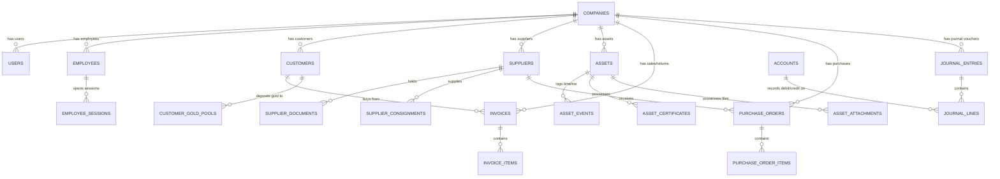

# DARFUS Jewellery ERP — Entity Relationship Diagram (ERD)

This document maps out the database schema, field constraints, precision policies, and indexes for the DARFUS PostgreSQL database.

---

## 1. Relational Diagram (Mermaid)

---

## 2. Table Specifications and Precisions

### 2.1. Decimal Precision Policy
As per strict enterprise requirements, all monetary values (prices, costs, tax, invoice totals, customer dues, supplier balances) and weight measurements (gold weights, gross weights, net weights, carat weights) are stored using:
- **`DECIMAL(20,8)`**

This eliminates any IEEE-754 floating point inaccuracies and guarantees exact precision during financial reporting and workshop melting calculations.

### 2.2. Indexing Strategy
To ensure query latency remains sub-millisecond as tables grow:
- **Tenancy Indexes**: Composite index on `(company_id)` is applied to all scoped tables.
- **Search Optimization**: B-Tree indexes are applied to search identifiers like `barcode`, `rfid`, `phone`, and `email`.
- **Foreign Keys**: Indexes are created on all referencing keys (e.g., `asset_id`, `invoice_id`, `employee_id`) to accelerate join queries.
